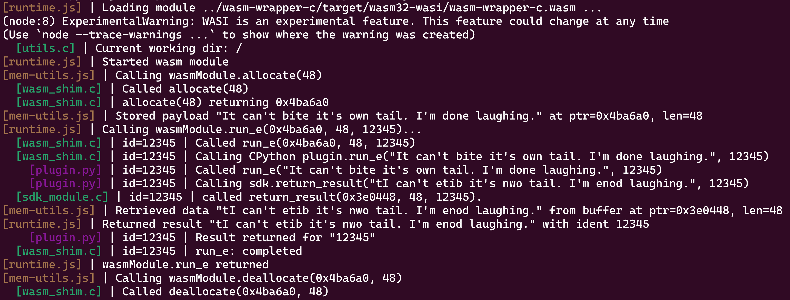
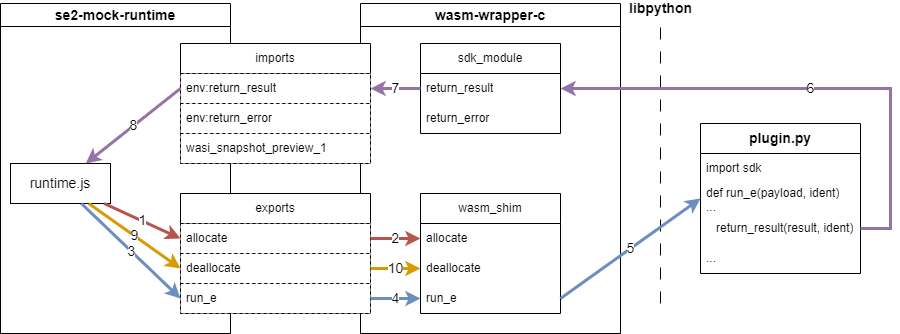

# Suborbital Python bindings

This is a basic showcase for WasmHost-to-Python and Python-to-WasmHost bindings, based on `libpython3.11.a`.

## TL;DR [5 min]

1. Just go to the [Fast track section](#how-to-build-and-run) to see how to run the example.

2. Take a look at the [Overview](#overview) to get to know what each subfolder contains.

3. Take a look at the diagram in [Deep dive](#deep-dive) to get the idea of what happens.

## The story

The code was developed in collaboration with Suborbital and mimics their [SE2](https://docs.suborbital.dev/introduction) plugins.

The bindings were created manually and the purpose is to demonstrate an end-to-end working approach.

A more generic approach to using Python interchangeably with server-side Wasm is in development by a group of collaborators from several interested companies. You can track the progress in the [Python guest runtime and bindings](https://bytecodealliance.zulipchat.com/#narrow/stream/223391-wasm/topic/Python.20guest.20runtime.20and.20bindings) stream on ByteCodeAlliance's Zulip space.

# Mimicking Suborbital SE2 Plugins

The Suborbital Extension Engine (SE2) allows people to write and deploy plugins based on WebAssembly. For this example, we chose to directly mimic the ABI defined in [suborbital/sdk](https://github.com/suborbital/sdk).

Functionally, a SE2 plugin is very similar to a serverless `run` function. Here is a brief description of what is expected from a Wasm module in order to work as an SE2 plugin.

Imports:

 - `return_result` - host function, used by the plugin to return execution result.
 - `return_error` - host function, used by the plugin to return execution error.

Exports:

 - `run_e` - this is the main execution method of the plugin. Can be called after the module is initialized, with execution identity passed as a parameter.
 - `allocate`/`deallocate` - methods used to delegate memory management primitives to the Wasm module. The `run_e` method from above is passed memory allocated by those.
 - `_start` - SE2 expects this method instead of `_initialize`, but even then the module is treated as a *reactor* (per the [WASI ABI](https://github.com/WebAssembly/WASI/blob/main/legacy/application-abi.md#current-unstable-abi))

 A basic execution flow:

  1. The runtime calls `_start_` to initialize the plugin Wasm module.
  2. The runtime calls `allocate` to reserve a memory buffer for processed data.
  3. The runtime copies data to be processed by the plugin to the memory buffer.
  4. The runtime calls `run_e` passing on the memory buffer + an *execution id*.
  5. The plugin processes the data and calls either `return_result` or `return_error` passing result data or error message in a memory buffer (reserved internally and managed by the plugin itself) along with the *execution id* for which it is returning.
  6. The `run_e` call also returns to the runtime.
  7. The runtime calls `deallocate` to clear the memory buffer used for the `run_e` call.

# Overview

This example uses three basic components

 - [*se2-mock-runtime*](./se2-mock-runtime/) - a Node JS app that mimics Suborbital's SE2 runtime

   - loads a Wasm module (equivalent to an SE2 plugin)
   - calls its `run_e` method to execute the plugin logic with a sample script
   - provides `return_result` and `return_error`, which are used by the plugin to return execution result

 - [*wasm-wrapper-c*](./wasm-wrapper-c/) - a C app (builds to a Wasm module), which

   - mimics an SE2 plugin by exporting the `run_e` method and using imported `return_result` or `return_error`
   - uses `libpython` to embed the Python interpreter and thus forward the implementation of `run_e` to a Python script.

 - [*py-plugin*](./py-plugin/) - a Python app

   - executed by the *wasm-wrapper-c* app
   - provides the actual implementation of `run_e` in pure Python - "string reversal for words that don't contain a single quote (`'`)"

# How to build and run

First, you need to clone this repository and `cd` to this example.

```shell
TMP_WORKDIR=$(mktemp -d)
git clone --depth 1 https://github.com/vmware-labs/webassembly-language-runtimes ${TMP_WORKDIR}/wlr
cd ${TMP_WORKDIR}/wlr/python/examples/bindings/se2-bindings
```

## Fast track

The fastest thing would be to just run the `run_me.sh` script. It uses pre-built container images to build *wasm-wrapper-c* and to run the *se2-mock-runtime* app.

Here is a sample session.

```shell
> ./run_me.sh

Running 'run_me.sh'
Building wasm-wrapper-c with
    'docker run -t
        -v /WLR/python/examples/bindings/se2-bindings:/workdir
        -w /workdir
        ghcr.io/vmware-labs/wasmlabs/wasi-builder:19.0
        bash -c "cd wasm-wrapper-c; ./build-wasm.sh --clean"'...
Building se2-mock-runtime with
    'docker run -t
        -v/WLR/python/examples/bindings/se2-bindings:/workdir
        -w /workdir
        node:16.20
        bash -c "cd se2-mock-runtime; npm i"'...
Running se2-mock-runtime with
    'docker run -t
        -v/WLR/python/examples/bindings/se2-bindings:/workdir
        -w /workdir
        node:16.20
        bash -c "cd se2-mock-runtime;
            node --experimental-wasi-unstable-preview1 .
                --wrapper ../wasm-wrapper-c/target/wasm32-wasi/wasm-wrapper-c.wasm
                --plugin-root ../py-plugin/
                --python-usr-root ../wasm-wrapper-c/target/wasm32-wasi/deps/"' ...
```

This will print an output where color and indentation mark the location of the code printing the line:



## The output

For easier understanding, we added simple logs in all straight-path functions in all the layers.

 - all *se2-mock-runtime* logs start at the beginning of the line and the filename is dark orange
 - all *wasm-wrapper-c* logs are indented by one tab and the filename is green
 - all *plugin.py* logs are indented by two tabs and the filename is violet

## Run on your own machine

You could choose to do things on your own machine. Then you will need to prepare the following:
W
 - *wasi-sdk*, *cmake*, *curl*, *tar*, *gzip* - to build the `wasm-wrapper-c` module
 - `WASI_SDK_PATH` env variable set to point to the *wasi-sdk* installation
 - *npm*, *Node* - to build and run the `se2-mock-runtime`

Then, you could either run `run_me.sh --local` or just the things one by one, following the steps below:

1. Build the wasm module in the `wasm-wrapper-c` folder using `build-wasm.sh`. Here is what happens during the build:

    - `libpython3.11` and its standard libraries get downloaded into `wasm-wrapper-c/target/wasm32-wasi/deps`
    - The Wasm wrapper module gets built into `wasm-wrapper-c/target/wasm32-wasi/wasm-wrapper-c.wasm`

2. Get all *Node* dependencies in the `se2-mock-runtime` folder by running `npm i`
3. Execute the example runtime in the `se2-mock-runtime` folder by running

   ```bash
   node --experimental-wasi-unstable-preview1 . \
        --wrapper ../wasm-wrapper-c/target/wasm32-wasi/wasm-wrapper-c.wasm \
        --plugin-root ../py-plugin/ \
        --python-usr-root ../wasm-wrapper-c/target/wasm32-wasi/deps/
   ```

   - `wrapper` is a path to the Wasm extension module, which provides the translation layer between the Python plugin and the runtime. This is `wasm-wrapper-c` from above.
   - `plugin-root` is added to `PYTHONPATH` and a `plugin.py`, which defines `run_e` is expected to be found there. There could be any other pure Python libraries in that folder, and they can be imported in `plugin.py`
   - `python-usr-root` is the path where the `usr/local/lib/...` path, containing Python's standard libraries is located. In this case, we reuse what was downloaded while building `wasm-wrapper-c`

# Deep dive

Take a look at the diagram to get to know what's going on.



 - Each call is outlined by a different color
 - Numbers indicate the overall order of calls in the basic flow in `runtime.js`

## se2-mock-runtime

Main entry point is in [`bin/runtime.js`](./se2-mock-runtime/bin/runtime.js)

 - Initialize the module calling `_start`
 - Allocate buffer from the Wasm module
 - Write data string to the buffer
 - Call `run_e` with the buffer
 - On `return_result` or `return_error` print logs
 - After `run_e` completes, deallocate the buffer with the Wasm module

## wasm-wrapper-c

 - [`pyhost.c`](./wasm-wrapper-c/pyhost.c) - basic Python host functionality

    - initialization of embedded Python interpreter
    - loading of the `sdk` module so it's accessible as a built-in by interpreted scripts
    - loading of a .py module so it can be called via the [Python C API](https://docs.python.org/3/c-api/index.html)

 - [`main.c`](./wasm-wrapper-c/main.c) - entry point

    - `main` is called during `_start` and later we will call other functions. Therefore, it only initializes stuff and does no cleanup before exiting
    - Uses `_initialize` from `wasm_shim.c` for the actual initialization.

 - [`wasm_shim.h`](./wasm-wrapper-c/wasm_shim.h) declares exports/imports

    - `_initialize` is not exported, because the SE2 engine uses `_start`.

 - [`wash_shim.c`](./wasm-wrapper-c/wasm_shim.c) defines the Runtime-to-Wasm bindings

     - `_initialize` inits the Python interpreter, loads `plugin.py` as a static `PyObject` to be used by `run_e` calls
     - `allocate` and `deallocate` are defined in the C code
     - `run_e` forwards the incoming call to `run_e` within the `plugin.py` module

 - [`sdk_module.c`](./wasm-wrapper-c/sdk_module.c) defines a C-implemented Python module

    - Implements `return_result` and `return_error`, which can be called from within Python scripts. They translate from the Python function calls to the imported host functions provided by the runtime.

## py-plugin

Has a single [plugin.py](./py-plugin/plugin.py) module

 - `run_e` accepts a UTF-8 string payload and reverses it word by word, unless the word contains a non-letter character (`'` or `.`, etc.)
 - uses `sdk.return_result` to return the result

